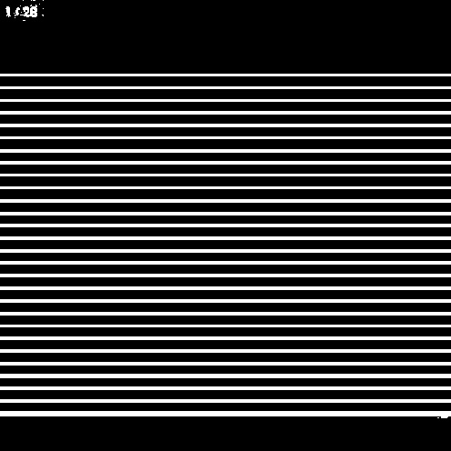
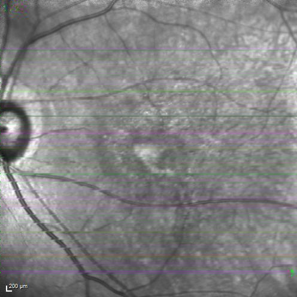

# APTOS-Challenge
Hi all here is the repo for some baseline methods for APTOS Big Data Competition 2021: Prediction on DME Patients' Response to Anti-VEGF Treatment.

# PreProcessing
Split any raw image to two parts: fundus image (496\*496) and macular OCT image (768\*496).

For example:
image = cv2.imread(img_path)

image_p1 = image[:496, :image.shape[1]-768, :]

image_p2 = image[:496, image.shape[1]-768:image.shape[1], :]  

# PreCST and CST
A straightforward method: segment the retinal layer and calculate the thickness. 
   
As we only need to predict the central thickness, we may further crop the central part of macular OCT image:   

image_p2 = image[:496, image.shape[1]-768+128:image.shape[1]-128, :]    
    

Then using segmentation networks the layer masks can be obtained, for example:

 

 

Finally the thickness can be calculated by counting the number of white pixels along the middle vertical line, then multiplying (200/50=4, from the ruler on the left-bottom) um.

 

To train a segmentation network, you may use the model and training data (1286 images available) from https://github.com/theislab/DeepRT. 
After clone thast repo, put `OCT_segmentation.py` to thickness_segmentation folder. Train (quite fast) and test in this folder also.

* As the training data in this challenge are weakly annotated, you may develop semi-supervised technique to fully utilized them.
* You may improve the performance using better architectures rather than traditional U-Net.

# IRF/SRF/PED/HRF
To determine if IRF/SRF/PED/HRF exists, two strategies may be considered: per image detection/segmentation or weakly-supervised classification of bag of images 

Detection/segmentation based:
For IRF, https://github.com/uw-biomedical-ml/irf-segmenter is a good pretrained model. 
For SRF/PED, you may refer to https://github.com/ShawnBIT/AI-Challenger-Retinal-Edema-Segmentation.
However, the training data are not available.
 
* So It's intresting to use these models as imperfect supervision for the data in this challenge.
I cannot find open data or models with decent performance to deal with HRF.  

Weakly-supervised classification of bag of images:
In this challenge, we only have per-ID annotations. 
* So it's straightforward to use multi-instance learning.
Such as in https://github.com/AMLab-Amsterdam/AttentionDeepMIL 

# VA
It's an open problem to predict the postVA values. We may look for answers from academic papers about correlations between VA and 
CST/IRF/SRF/PED/HRF/metadata. Maybe predicting the VA difference (delta VA) from the changes of fundus or aligned OCT images is a good way. 

# Continue injection
It sounds like a data mining topic to determine whether the injection shall be continued or not. Models (such as LR, SVM, neural networks, etc) may be built upon the predicted values of
pre and post VA/CST/IRF/SRF/PED/HRF and meta data. Images may also be used to train another DNN independently then ensemble.

# Using of the fundus images

Fundus images may also be used for regression of CST, VA, or prediction for IRF/SRF/HRF and so on.
However, green lines are drawn on the raw images. Here we show some simple strategies to filter them and inpaint the images.
See `inpaint_green.py` for examples.

  

* You may use other powerful methods to restore the fundus images or just use them directly.
* To use fundus images it's recommended to finetune on a pretrained model trained using a large fundus images dataset, also from https://github.com/theislab/DeepRT.
